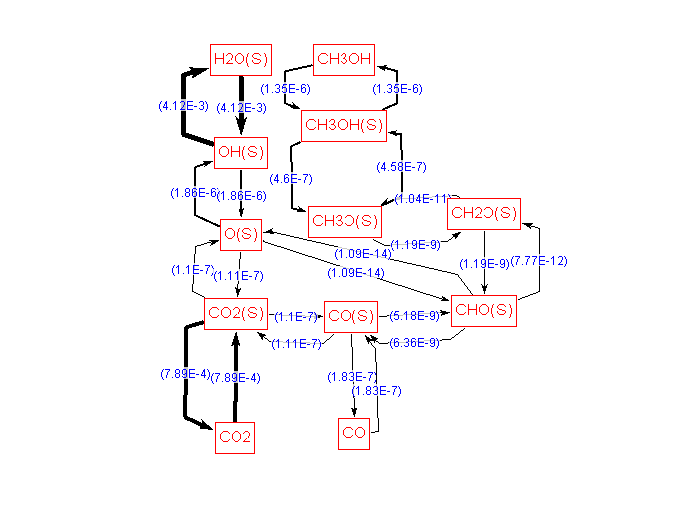
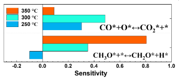
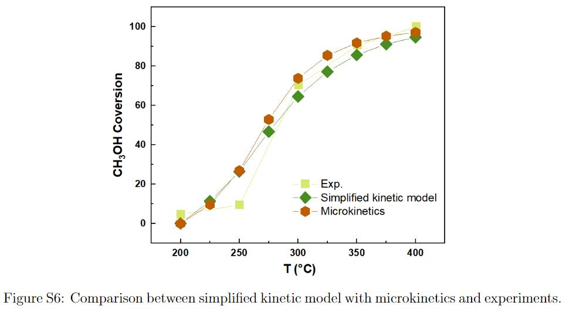

## Step 1. Simplified kinetic model

The reaction network of steam reforming of methanol (SRM) used for the microkinetic modeling is illustrated as below:

The values in blue are rate constants. Based on the microkinetic model, we performed sensitivity analysis by computing the partial derivatives of the methanol conversion rate with respect to the rate constant of individual elementary reaction, and identified two rate determining steps (RDSs) that have partial derivatives greater than 0.01, as shown below. 

We then constructed a simplified kinetic model in which only RDSs are considered as non-equilibrium reactions. The python code of the simplified kinetic model is  [MSR_CSTR.py](./MSR_CSTR.py), the results of which agree well with those obtained with the microkinetic modeling based on the full reaction network.

## Step 2. Linear scaling relationships in SRM
The main inputs for the simplified kinetic model are the activation energies of RDSs. Following scaling relationships are used $\Delta E_{a,\rm CH_3OH} = 0.17E_{\rm ad, C*} + 0.36E_{\rm ad, O*} -23.004$ (eV), $\Delta E_{a,+}^{\rm WGS} = 0.25E_{\rm ad, C*} + 0.825E_{\rm ad, O*}+6.114$ (eV), $\Delta E_{a,-}^{\rm WGS} = 0.25E_{\rm ad, C*} + 0.825E_{\rm ad, O*}+6.985$ (eV).
Combining the adsorption energies of C* and O* predicted with a deep neural network (see details in [Adsorption_energies_prediction_by_DL](../3.%20Adsorption_energies_prediction_by_DL) , we can construct a volcano plot using [volcano_plot.py](./volcano_plot.py) for thousands of metallic alloys. 

