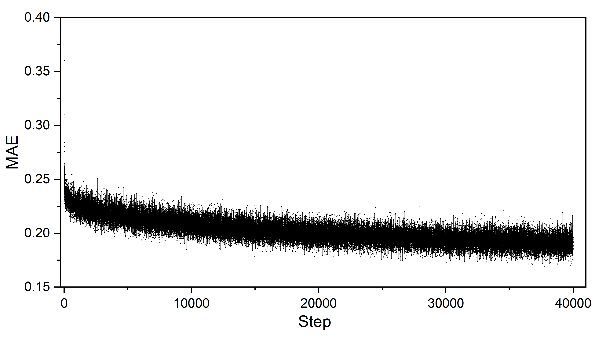
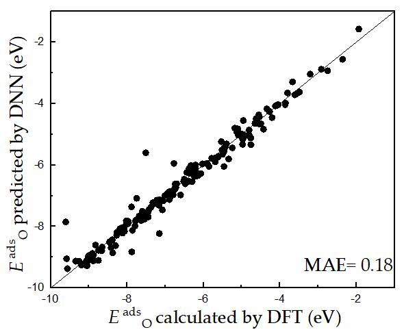
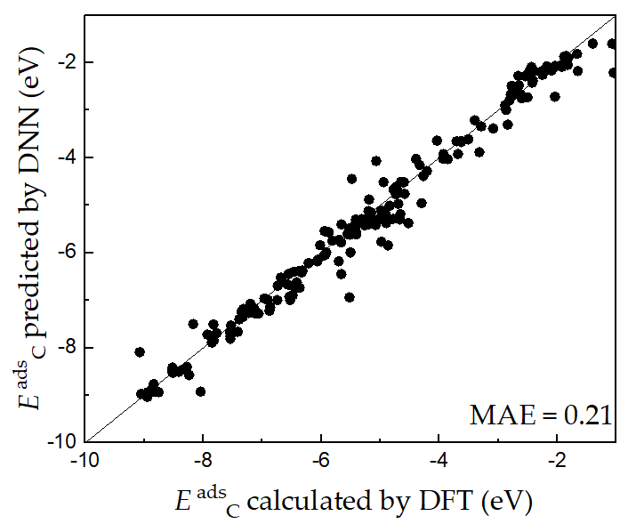

# Adsorption Energy Prediction Assisted by Deep Learning
## Step 1. DFT database of adsorption energies
The databases of C * and O* adsorption energies on CsCl-type binary alloys are provided as [database_C](./database_C.dat)  and [database_O](./database_O.dat), respectively.  

## Step 2. Training DNN 
[kerasNN.py](./kerasNN.py) is a script that trains a deep neural network (DNN) using [database_C](./database_C.dat)  and [database_O](./database_O.dat). Parameters of the DNN model in this work includes: the number of neurons of the input layer is 21, including 10 features for each of the two elements and the coordination number of the adsorption site; the 10 features of each element are the numbers of $s$-, $p$-, $d$-, and $f$-electrons, the first and second ionization potentials, the electron affinity, the covalent radius, the main valence state, and the row number of the element in the periodic table; there are eight hidden layers with a width of 20; the activation function of the input and hidden layers is the exponential linear unit (ELU); the output layer is a linear neuron that exports the adsorption energy of C* or O*; the mean absolute error (MAE) is used as the loss function; the optimization algorithm of AdaMax is adopted; the learning rate is 0.004. The ratio of the training and validation data is 3:1. The trained DNN model file is for [model_file_C.h5](./model_file_C.h5) for C and [model_file_O.h5](./model_file_O.h5) for O, respectively.

#### Evolution of MAE during the training

 

#### Validation

             

## Step 3. Adsorption energy prediction with trained DNN models 
Simply run the python script  [NNPredict.py](./NNPredict.py). The required input files include a [dat](./properties_of_alloys.dat) file that describes the properties of alloys and trained [DNN model files](model_file_C.h5). 

