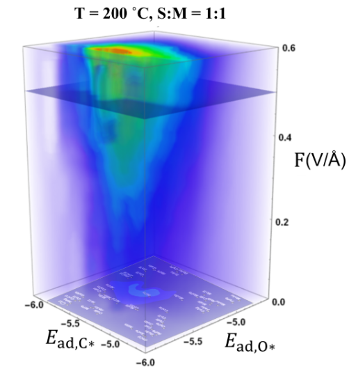

# 3-dimensional Volcano Plot
The conversion rates of methanol at 474 K under EEFs for different metallic alloys can be estimated with the python script [3d_data_generation_T473K.py](./3d_data_generation_T473K.py), whose output is [newn_T473K_interp.csv](./newn_T473K_interp.csv). We offer a Mathematica notebook [3D_volcanoplot.nb](./3D_volcanoplot.nb) to generate the 3D volcano plot from [newn_T473K_interp.csv](./newn_T473K_interp.csv) as follows:

 

